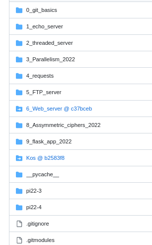

Как отправить аудио и видео с помощью программирования сокетов в Python
==============================================================


Здравствуйте друзья!Сегодняшнее учебное пособие по отправке аудио- видеопотока с помощью TCP\UDP-сервера прослушивающему клиенту. Эти потоки будут извлечены из файла MP4. Мы будем использовать сокет UDP для передачи видеопотока и сокет TCP для аудио -потока. Каждый файл MP4 состоит из этих двух потоков, с различной частотой кадров и частотой битрейта аудио.Обычно битрейд аудио установлен на 44100 Гц.Однако частота видео кадров может варьироваться, например, есть стандартные 15 кадров в секунду (FPS), 20 кадров в секунду, 24 кадры, 30 кадров в секунду или даже больше. Если мы просто используем библиотеку OpenCV (лаб 1) для извлечения кадров MP4, то при отправке (с задержкой в 1 мс на каждый кадр), то, возможно, ваше видео не воспроизведется при этой нестандартной частоте кадров.

Но, Спасибо нашему другу Эйтану, который предложил сделать это руководство для решения проблемы нестандартной частоты кадров в видеофайлов формата OpenCV. Эти различия вызваны тем фактом, что когда мы отображаем изображение opencv в цикле while, мы считаем, что оно воспроизводится с задержкой перспективы, заданной в функции waitKey(). Задержка в функции waitKey () очень важна для правильного отображения видео при правильной частоте кадров. Таким образом, вопрос в том, как сохранить заданную частоту кадров видео во время рендеринга? Вероятный ответ — стабилизировать время выборки рендеринга (TS) в цикле, проверяя, является ли текущая частота кадров выше или ниже желаемой собственной частоты кадров. Соответственно, надо будет увеличить или уменьшить время выборки.

В приведенном ниже блоке кода показано, как получить количество кадров в секунду (FPS) файла MP4

    vid = cv2.VideoCapture(filename)
    FPS = vid.get(cv2.CAP_PROP_FPS)
    

Допустим, FPS-это измеренные кадры в секунду в режиме реального времени, поэтому приведенный ниже код показывает, как регулировать TS:

    if fps>FPS:
        TS+=0.001
    elif fps<FPS:
        TS-=0.001
    else:
        pass
    

Ниже приведен код Server.py, который одновременно запускает три потока для получения синхронизации:
```py
    executor.submit(audio_stream)  # to generate and send stream of audio data
    executor.submit(video_stream_gen) # to generate stream of frames
    executor.submit(video_stream) # to obtain and send video stream, with a synchronized fps
```   

Ниже будет полный код Server.py. Замените `filename = 'count.mp4'`` на ваш файл MP4, а также измените `host_ip =' 192.168.1.21' 'на ваш. В начале аудиопоток будет извлечен из этого файла и сохранен как «temp.wav».Также обратите внимание, что FFMPEG должен быть установлен в вашем системе. Вы можете загрузить [ffmpeg](https://ffmpeg.org/download.html) ffmpeg из раздела «Получить пакеты и исполняемые файлы» в соответствии с вашей ОС. После установки FFMPEG вы можете проверить установку, написав это в терминале:

    ffmpeg
    

И вы увидите вывод типа:

    ffmpeg version 3.4.1 Copyright (c) 2000-2017 the FFmpeg developers
      built with Apple LLVM version 9.0.0 (clang-900.0.39.2)
     ...
     ...
    

Вам также нужен Pyaudio, если вы не можете установить его с помощью PIP -установщика, то, перейдите в терминал и используйте эту команду:

    pip3.9 install PyAudio‑0.2.11‑cp36‑cp39m‑win_amd64.whl
    


## server.py
```py
# This is server code to send video and audio frames over UDP/TCP

import cv2, imutils, socket
import numpy as np
import time
import base64
import threading, wave, pyaudio,pickle,struct
import sys
import queue
import os
# For details visit pyshine.com
q = queue.Queue(maxsize=10)

filename =  'count.mp4'
command = "ffmpeg -i {} -ab 160k -ac 2 -ar 44100 -vn {}".format(filename,'temp.wav')
os.system(command)

BUFF_SIZE = 65536
server_socket = socket.socket(socket.AF_INET,socket.SOCK_DGRAM)
server_socket.setsockopt(socket.SOL_SOCKET,socket.SO_RCVBUF,BUFF_SIZE)
host_name = socket.gethostname()
host_ip = '192.168.1.21'#  socket.gethostbyname(host_name)
print(host_ip)
port = 9688
socket_address = (host_ip,port)
server_socket.bind(socket_address)
print('Listening at:',socket_address)

vid = cv2.VideoCapture(filename)
FPS = vid.get(cv2.CAP_PROP_FPS)
global TS
TS = (0.5/FPS)
BREAK=False
print('FPS:',FPS,TS)
totalNoFrames = int(vid.get(cv2.CAP_PROP_FRAME_COUNT))
durationInSeconds = float(totalNoFrames) / float(FPS)
d=vid.get(cv2.CAP_PROP_POS_MSEC)
print(durationInSeconds,d)

def video_stream_gen():
   
    WIDTH=400
    while(vid.isOpened()):
        try:
            _,frame = vid.read()
            frame = imutils.resize(frame,width=WIDTH)
            q.put(frame)
        except:
            os._exit(1)
    print('Player closed')
    BREAK=True
    vid.release()
	

def video_stream():
    global TS
    fps,st,frames_to_count,cnt = (0,0,1,0)
    cv2.namedWindow('TRANSMITTING VIDEO')        
    cv2.moveWindow('TRANSMITTING VIDEO', 10,30) 
    while True:
        msg,client_addr = server_socket.recvfrom(BUFF_SIZE)
        print('GOT connection from ',client_addr)
        WIDTH=400
        
        while(True):
            frame = q.get()
            encoded,buffer = cv2.imencode('.jpeg',frame,[cv2.IMWRITE_JPEG_QUALITY,80])
            message = base64.b64encode(buffer)
            server_socket.sendto(message,client_addr)
            frame = cv2.putText(frame,'FPS: '+str(round(fps,1)),(10,40),cv2.FONT_HERSHEY_SIMPLEX,0.7,(0,0,255),2)
            if cnt == frames_to_count:
                try:
                    fps = (frames_to_count/(time.time()-st))
                    st=time.time()
                    cnt=0
                    if fps>FPS:
                        TS+=0.001
                    elif fps<FPS:
                        TS-=0.001
                    else:
                        pass
                except:
                    pass
            cnt+=1
            
            
            
            cv2.imshow('TRANSMITTING VIDEO', frame)
            key = cv2.waitKey(int(1000*TS)) & 0xFF	
            if key == ord('q'):
                os._exit(1)
                TS=False
                break	
                

def audio_stream():
    s = socket.socket()
    s.bind((host_ip, (port-1)))

    s.listen(5)
    CHUNK = 1024
    wf = wave.open("temp.wav", 'rb')
    p = pyaudio.PyAudio()
    print('server listening at',(host_ip, (port-1)))
    stream = p.open(format=p.get_format_from_width(wf.getsampwidth()),
                    channels=wf.getnchannels(),
                    rate=wf.getframerate(),
                    input=True,
                    frames_per_buffer=CHUNK)

    client_socket,addr = s.accept()

    while True:
        if client_socket:
            while True:
                data = wf.readframes(CHUNK)
                a = pickle.dumps(data)
                message = struct.pack("Q",len(a))+a
                client_socket.sendall(message)
                

from concurrent.futures import ThreadPoolExecutor
with ThreadPoolExecutor(max_workers=3) as executor:
    executor.submit(audio_stream)
    executor.submit(video_stream_gen)
    executor.submit(video_stream)
```
### Запустите сервер:

    python server.py
    

После запуска server.py очередь кадров будет брать 10 кадров, останавливать выполнение кода и ждать, пока первый кадр будет извлечен из очереди, а затем продолжится процесс добавления и удаления кадров из очереди. Обратите внимание, что окна imshow() располагаются в предопределённых местах, если мы перетащим эти окна, то работа отображения кадров повлияет на синхронизацию. Если код запущен, пожалуйста, оставьте в покое окно с изображениями на их исходных местах. Это просто доказательство концепции, что видео и аудиоданные могут быть отправлены из сокетов с помощью Python. Если вы хотите выйти из приложения, в любой момент щелкните окно с видеопотоком и нажмите q. После настройки сервера запустите приведенный ниже клиентский код, и вы увидите, как стабилизируется частота кадров и происходит синхронизация аудио и видео.

### client.py

```py
# Welcome to PyShine
# This is client code to receive video and audio frames over UDP/TCP

import cv2, imutils, socket
import numpy as np
import time, os
import base64
import threading, wave, pyaudio,pickle,struct
# For details visit pyshine.com
BUFF_SIZE = 65536

BREAK = False
client_socket = socket.socket(socket.AF_INET,socket.SOCK_DGRAM)
client_socket.setsockopt(socket.SOL_SOCKET,socket.SO_RCVBUF,BUFF_SIZE)
host_name = socket.gethostname()
host_ip = '192.168.1.21'#  socket.gethostbyname(host_name)
print(host_ip)
port = 9688
message = b'Hello'

client_socket.sendto(message,(host_ip,port))

def video_stream():
	
	cv2.namedWindow('RECEIVING VIDEO')        
	cv2.moveWindow('RECEIVING VIDEO', 10,360) 
	fps,st,frames_to_count,cnt = (0,0,20,0)
	while True:
		packet,_ = client_socket.recvfrom(BUFF_SIZE)
		data = base64.b64decode(packet,' /')
		npdata = np.fromstring(data,dtype=np.uint8)
	
		frame = cv2.imdecode(npdata,1)
		frame = cv2.putText(frame,'FPS: '+str(fps),(10,40),cv2.FONT_HERSHEY_SIMPLEX,0.7,(0,0,255),2)
		cv2.imshow("RECEIVING VIDEO",frame)
		key = cv2.waitKey(1) & 0xFF
	
		if key == ord('q'):
			client_socket.close()
			os._exit(1)
			break

		if cnt == frames_to_count:
			try:
				fps = round(frames_to_count/(time.time()-st))
				st=time.time()
				cnt=0
			except:
				pass
		cnt+=1
		
			
	client_socket.close()
	cv2.destroyAllWindows() 


def audio_stream():
	
	p = pyaudio.PyAudio()
	CHUNK = 1024
	stream = p.open(format=p.get_format_from_width(2),
					channels=2,
					rate=44100,
					output=True,
					frames_per_buffer=CHUNK)
					
	# create socket
	client_socket = socket.socket(socket.AF_INET,socket.SOCK_STREAM)
	socket_address = (host_ip,port-1)
	print('server listening at',socket_address)
	client_socket.connect(socket_address) 
	print("CLIENT CONNECTED TO",socket_address)
	data = b""
	payload_size = struct.calcsize("Q")
	while True:
		try:
			while len(data) < payload_size:
				packet = client_socket.recv(4*1024) # 4K
				if not packet: break
				data+=packet
			packed_msg_size = data[:payload_size]
			data = data[payload_size:]
			msg_size = struct.unpack("Q",packed_msg_size)[0]
			while len(data) < msg_size:
				data += client_socket.recv(4*1024)
			frame_data = data[:msg_size]
			data  = data[msg_size:]
			frame = pickle.loads(frame_data)
			stream.write(frame)

		except:
			
			break

	client_socket.close()
	print('Audio closed',BREAK)
	os._exit(1)
	


from concurrent.futures import ThreadPoolExecutor
with ThreadPoolExecutor(max_workers=2) as executor:
	executor.submit(audio_stream)
	executor.submit(video_stream)


```
### Запустите клиента так:

    python client.py
    
## Обязательные шаги (2 балла):
______________
-  Сделаем скриншот и опубликуем его в папке этого репозитория для проверки преподавателем

 

- Затем запушим на github. **Не забудьте про .gitignore**

- После чего добавим этот проект как субмодуль (например на скриншоте Kos@b258316 - субмодуль) в наш глобальный репозиторий со всей практикой  ***Фамилия- fa-np-practice*** 

 